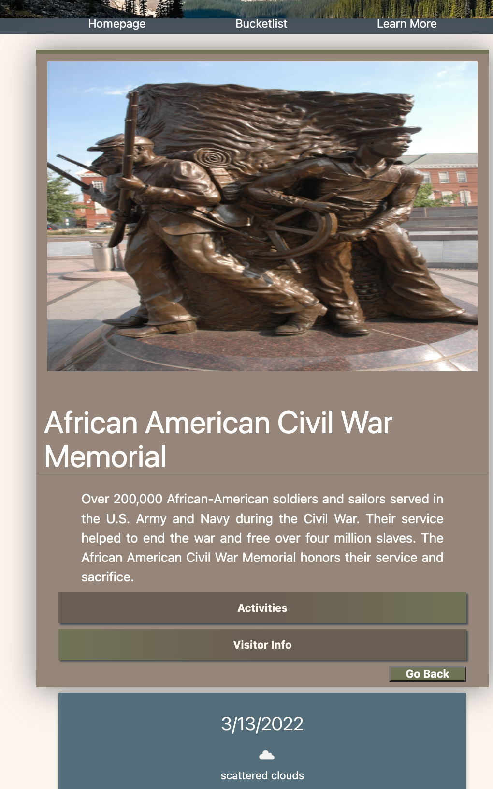

# parkscape

## Designed and completed by Emily Pape, Julie Taukei, and David Samuelson

## project URL

https://emilypape.github.io/parkscape/

## repo URL

https://github.com/emilypape/parkscape

## User Story

As an avid traveler I would like to select a national park and my dates of travel I would like a list of the most popular hikes for each park I would like to be able to check the forecast for my selected dates I would also like the location and travel information for the park If I see a hike I like, I would like to be able to add it to a todo list for my vacation I also would like the ability to delete the hikes if I change my mind.

## Project Slideshow

https://docs.google.com/presentation/d/1OoXX0HKZem2590vwjVzONLLHp5x8ZkYyf47MJckjJ7g/edit?usp=sharing

## Using the page

ParkScape is an intuitive and simple way to get information on and play your next trip to any of the national parks as recorded by the National park service. Upon opening the page you will be greeted with a box that allows you to start typing, or if you'd like to scroll you can start selecting, any of the national parks that fall into the NPS purview. Currently the NPS covers 495 parks around the US.

as you start typing in the name of the park you are looking for the selctions will narrow down to parks that fit your text, if it is not found there then it is not available under the NPS purview. The drop down will give you the park code and the general park name so you are sure to get the park you are looking for

Then you can select the dates that you are planning on going to visit the park

once that is selected you can submit the form and be taken to a page that includes some brief information on the park as well as the weather over the next week.

From here you can decide to go into an activities page where you can add activities to your "Bucketlist" of things you'd like to do:

Or you can go to the visitors information page where you will see the map location of the park, the hours of operation, and contact information for the park:

At any time you can see your bucketlist of desired activities and remove them as desired:

these pages are also mobile friendly, allowing you to look up the park information at any time you would like:

## API's used

NPS (National Park Service) API

OpenView Weather API

Leaflet.js

## CSS frameworks

Custom CSS mostly

materializecss

## Technology used

jQuery

moment.js

